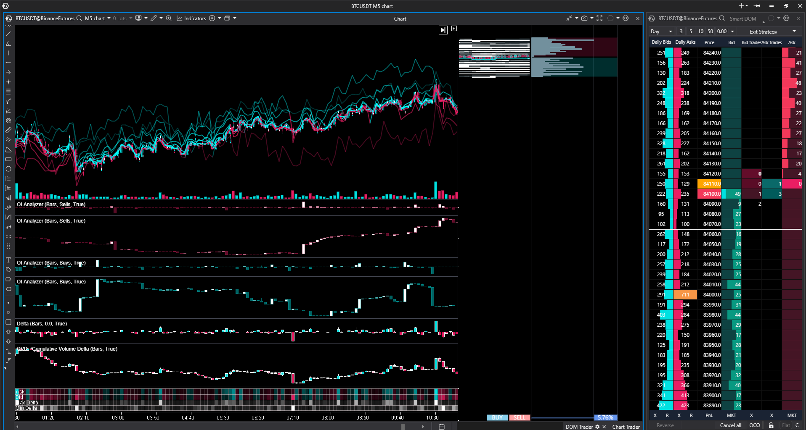

# Singularity-Indicator
An advanced Multi-Neural Network stock/crypto price predictor. (I am not responsible for any financial gains or losses incurred by the users of this tool).

For use in ATAS trading software.

Instructions:
Place 'SingularityTemplate.cts' in 'Documents\ATAS\Chart\Templates'

Place 'SingularityIndicator.dll' in 'Documents\ATAS\Indicators'

Place 'SingularityDOMTemplate.dts' in 'Documents\ATAS\SmartDOM\Templates'

Restart ATAS.

Load the template 'SingularityTemplate' in ATAS interface.

Load the Smart DOM template via the DOM settings (cog icon).

